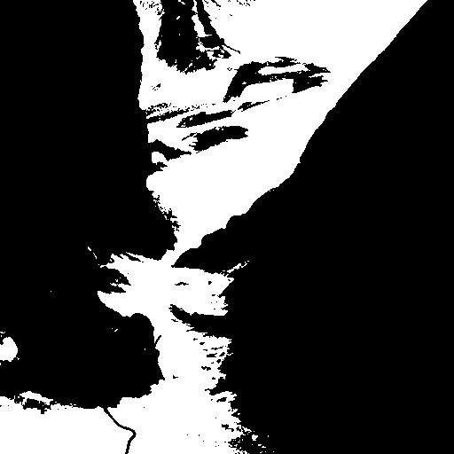
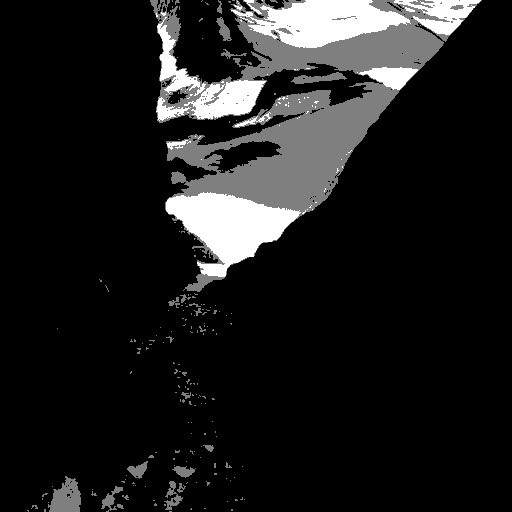
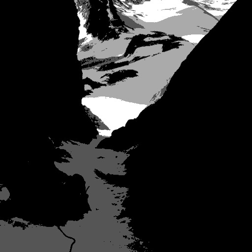

# HMIN211 - Compte Rendu TP1 (Odorico Thibault)

## Sommaire [↺](#sommaire-)

- [Image En Niveaux de gris (Format PGM)](#image-en-niveaux-de-gris-format-pgm-)
	- [Image de reference](#image-de-reference-)
	- [Seuillage](#seuillage-)
		- [Un Niveaux de Seuil](#un-niveaux-de-seuil-)
		- [Plusieurs Niveaux de Seuils](#plusieurs-niveaux-de-seuils-)
	- [Profil d'Une Ligne et d'Une Colonne](#profil-d-une-ligne-et-d-une-colonne-)
	- [Histogramme](#histogramme)
- [Image En Couleurs (Format PPM)](#image-en-couleurs-format-ppm-)
	- [Image de Réference](#image-de-réference-)
	- [Histogramme](#histogramme-)
	- [Seuillage](#seuillage-)
		- [Un Niveaux de Seuil](#un-niveaux-de-seuil-)
		- [Plusieurs Niveaux de Seuils](#plusieurs-niveaux-de-seuils-)

## Image En Niveaux de gris (Format PGM) [↺](#sommaire-)

### Image de reference [↺](#sommaire-)

### Seuillage [↺](#sommaire-)

On realise plusieurs seuillage sur l'image de réference avec S representant la valeur du seuil.

#### Un Niveaux de Seuil [↺](#sommaire-)

| S = 64                | S = 128                 | S = 192                     |
| ----------------      | ----------------------- | --------------------------- |
|  |   |       |

Plus le seuil est bas plus la couleur blanche aura de chances d'apparaitre.

#### Plusieurs Niveaux de Seuils [↺](#sommaire-)

| S = ( 85, 170 )           | S = ( 64, 128, 192 )          | S = ( 50, 100, 150, 200 )         |
| ----------------          | -----------------------       | ---------------------------       |
|  |  |  |

### Profil d'Une Ligne et d'Une Colonne [↺](#sommaire-)

On realise les profils de l'image de référence (format 512x512) sur la ligne d'indice 255 et la colonne d'indice 255 nous permettant de visualisé plus précisement la valeur de niveau de gris de chaque indice de la ligne/colonne.

	
Profil ligne et colonne = 255

	

<table style="width:33%" align="center">
	<tr>
		<th>Profil ligne et colonne = 255</th>
    </tr>
	<tr>
		<td></td>
	</tr>
</table>

A l'aide de gnuplot nous obtenons les profils suivants :

<table>
    <tr>
		<th>Profil ligne = 255</th>
		<th>Profil colonne = 255</th>
    </tr>
	<tr>
		<td></td>
		<td></td>
	</tr>
</table>

- **Profil de la ligne 255**
	- Le profil est globalement noir sauf au centre ou l'on à une bande de blanc (~ de l'indice 200 à 260)
- **Profil de la colonne 255**
	- Le profil est plus varié on peut le decoupé en 3 parties
		- (de l'indice 0 à 150) on observe une alternance de claire et de foncée
		- (de l'indice 150 à 250) on observe une bande de claire
		- Et enfin (de l'indice 250 à 512) on observe une bande de couleur foncée

Ces deux profils confirment bien ce que nous observont dans l'image, les parties foncées correspondent aux roches, aux herbes et les parties clairs correspondent à la neige.

### Histogramme [↺](#sommaire-)

L'histogramme d'une image nous permet d'observer les occurences d'une couleur (ici en niveau de gris) dans l'image.

Voici ci-dessous l'histogramme de notre image de reference :

<table style="width:33%" align="center">
	<tr>
		<td></td>
	</tr>
</table>

Il nous permet d'observé 4 pics de couleurs dont du noir(0-10) 50%, du gris(60-70) à 10%, du gris(150-170) à 5% et du blanc(250-255) à 2% avec les taux representant leurs occurences dans l'image.

## Image En Couleurs (Format PPM) [↺](#sommaire-)

### Image de Réference [↺](#sommaire-)

<table style="width:33%" align="center">
	<tr>
		<td></td>
	</tr>
</table>

### Histogramme [↺](#sommaire-)

Ici on realise l'histogramme de l'image en prenant en compte les composantes rouge/vert/bleu de l'image

<table style="width:33%" align="center">
	<tr>
		<td></td>
	</tr>
</table>

### Seuillage [↺](#sommaire-)

- On realise plusieurs seuillage sur l'image de réference avec :
	- Sr representant la valeur du seuil pour les couleurs rouges de l'image
	- Sg representant la valeur du seuil pour les couleurs vertes de l'image
	- Sb representant la valeur du seuil pour les couleurs bleues de l'image

#### Un Niveaux de Seuil [↺](#sommaire-)

On seuil sur chaque images une composante de l'image

<table>
    <tr>
		<th>Sr = 255</th>
		<th>Sr = Sg = 255</th>
		<th>Sr = Sg = Sb = 255</th>
    </tr>
	<tr>
		<td></td>
		<td></td>
		<td></td>
	</tr>
</table>

- En seuillant le rouge, l'image devient cyan comme il reste les compostante verte et bleu de l'image
- En seuillant le rouge et le vert, l'image devient bleu comme c'est la seule composante restante de l'image
- En seuillant le rouge, le vert et le bleu, l'image devient noir comme il ne restent plus aucune composante à l'image

#### Plusieurs Niveaux de Seuils [↺](#sommaire-)

On utillise ici le meme niveau de seuils sur chaque composantes de Rouge/Vert/Bleu de l'image

<table>
    <tr>
		<th>Srgb = ( 85, 170 )</th>
		<th>Srgb = ( 64, 128, 192 )</th>
		<th>Srgb = ( 50, 100, 150, 200 )</th>
    </tr>
	<tr>
		<td></td>
		<td></td>
		<td></td>
	</tr>
</table>
