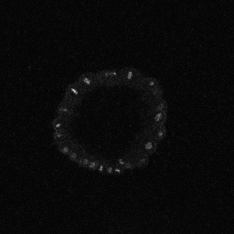
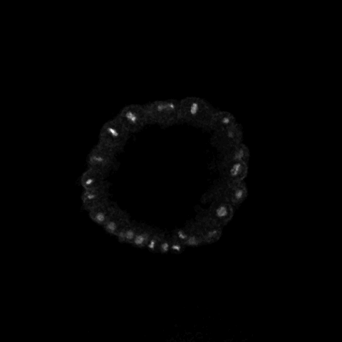
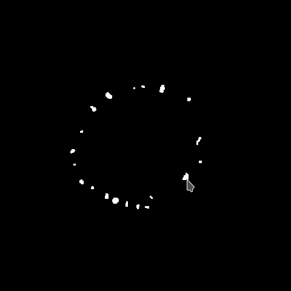
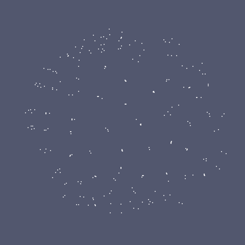
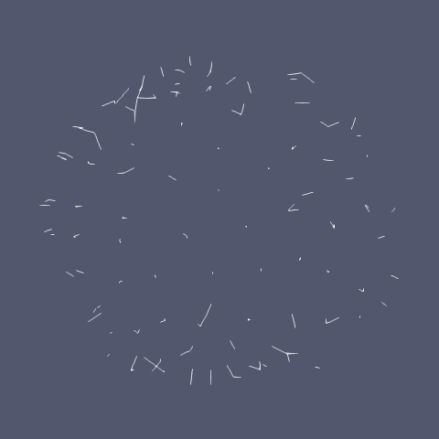
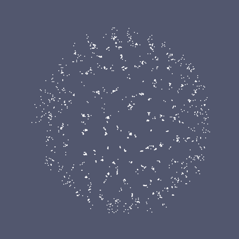

# TP4 - Imagerie 4D

Ce TP à été réalisé par **Odorico Thibault** et **Isnel Maxime** le **Mercredi 27/11/2019**.

[TOC]

## Suivi de cellules

### 1. Adoucissement de l'image

| Image brut                                                   | Image filtre médian                                          |
| ------------------------------------------------------------ | ------------------------------------------------------------ |
|  |  |

Comme on peut le voir sur les images ci-dessus, le filtre médian permet d'adoucir grandement le bruit des images et de mettre en évidence les structures importantes de l'image. C'est donc un bon outils pour faciliter la segmentation des cellules dans notre cas.

### 2. Segmentation et Morphologie

Avec notre programme l'utilisateur doit cliquer au centre d'une cellule dont l'intensité est dans la moyenne des autres cellule.

Au clic de l’utilisateur la moyenne des pixels $ M_p $ (dans un rayon de 4 pixels autours du curseur) est calculée (la moyenne permet de réduire les erreurs d’imprécisions). Ensuite on seuil l'image avec cette valeur $ M_p $ et pour finir on applique à la suite : une dilatation, 2 érosions et enfin une dilatation sur les voxels pour éliminer le bruit restant.

| Image de référence                                           | Image segmenté + opération morphologique                     |
| ------------------------------------------------------------ | ------------------------------------------------------------ |
|  |  |

### 3. Translation

CImg permet de labelliser les structures isolés dans une image, cela nous permet de calculer une position pour chaque cellules facilement.

Pour connaître le déplacement des cellules dans chaque images 3D il nous suffit ensuite de calculer pour chaque position d'une images $ I_i $ la différence avec les positions les plus similaires dans l'image $ I_{i+1} $ on obtient ainsi les vecteurs de déplacement de chaque cellules de $ I_i $ vers $ I_{i + 1} $.

En écrivant ces vecteurs dans un format .obj puis en les lisant avec ParaView on obtiens les trajectoires 3D suivantes :

| Image stack-[0-3].hdr Points                                 | Image stack-[0-3].hdr Trajectoires                           |
| ------------------------------------------------------------ | ------------------------------------------------------------ |
|  |  |

Avec une plus grande quantitée d'images 3D on obtient les trajectoires suivantes :

| Image stack-[0-20].hdr Points                                | Image stack-[0-20].hdr Trajectoires                          |
| ------------------------------------------------------------ | ------------------------------------------------------------ |
|  |  |

Les trajectoires formées par les lignes on bien l'air cohérentes avec le mouvement qu'accomplissent les cellules dans le temps. Cependant il aurait tout de même pu être possible d'améliorer les résultats en se basant sur d'autres critères que la distance la plus proche entre deux points de 2 images. On aurait possiblement pu se baser sur un système multi critère, par exemple en se basant sur la **similaritée de position** comme nous l'avons fait mais en ajoutant un critère de **similarité d'intensité de voxel** représentant une cellule. On peut très bien imaginer pouvoir attribuer un poid à chaque critère pour faire varier leur importance et ainsi obtenir des résultats plus ou moins bon.

## Code Source

```cpp
#include <iostream>
#include <algorithm>
#include <limits>
#include <string>
#include <array>
#include <vector>
#include <thread>
#include <chrono>
#include <map>

#include "CImg.h"

using namespace cimg_library;
using namespace std::chrono_literals;

template<class T>
using vec3 = std::array<T, 3>;
using vec3i = vec3<int>;
using vec3u = vec3<unsigned int>;
using vec3f = vec3<float>;
using vec3d = vec3<double>;

template<class T>
vec3<T>& operator+=(vec3<T>& left, const vec3<T>& right)
{
	left[0] += right[0];
	left[1] += right[1];
	left[2] += right[2];

	return left;
}

template<class T>
vec3<T> operator-(const vec3<T>& left, const vec3<T>& right)
{
	return {left[0] - right[0],
	        left[1] - right[1],
	        left[2] - right[2]};
}

template<class T, class U>
vec3<T>& operator/=(vec3<T>& left, U value)
{
	left[0] /= value;
	left[1] /= value;
	left[2] /= value;

	return left;
}

template<class T, class U>
vec3<T> operator/(const vec3<T>& left, U value)
{
	return {left[0] / value,
	        left[1] / value,
	        left[2] / value};
}

template<class T, class U>
vec3<T> to_vec3(const vec3<U>& v)
{
	return {(T)v[0], (T)v[1], (T)v[2]};
}

template<class T>
double distance_squared(const vec3<T>& left, const vec3<T>& right)
{
	double dist = 0;

	for (size_t i = 0 ; i < left.size() ; i++)
		dist += pow(left[i] - right[i], 2);

	return dist;
}

template<typename T>
bool operator<(const vec3<T>& left, const vec3<T>& right)
{
	if (left[0] < right[0])
	{
		return true;
	}
	else if (left[0] == right[0])
	{
		if (left[1] < right[1])
		{
			return true;
		}
		else if (left[1] == right[1])
		{
			return left[2] < right[2];
		}
	}

	return false;
}

template<class T>
std::ostream& operator<<(std::ostream& os, const vec3<T>& v)
{
	return os << '(' << v[0] << ", " << v[1] << ", " << v[2] << ')';
}

template<class T>
std::ostream& operator<<(std::ostream& os, const std::vector<T>& vect)
{
	for (const auto& v : vect)
		os << v << '\n';

	return os;
}

// renvoie la moyenne des intensité dans une région dont le centre est vox_coord
double region_intensity(const CImg<float>& img, const vec3i& vox_coord, int region_radius)
{
	double sum = 0;
	unsigned int count = 0;

	int min_x = vox_coord[0] - region_radius;
	int min_y = vox_coord[1] - region_radius;

	min_x = min_x < 0 ? 0 : min_x;
	min_y = min_y < 0 ? 0 : min_y;

	for (int x =  min_x ; x < min_x + 1 + 2 * region_radius; ++x)
	{
		for (int y = min_y ; y < min_y + 1 + 2 * region_radius ; ++y)
		{
			sum += img(x, y, vox_coord[2]);
			count++;
		}
	}

	return sum / count;
}

// il faut que l'image soit seuiller avant de récuperer les centroids
std::vector<vec3d> get_cells_centroid(const CImg<float>& thresholded_img)
{
	std::cerr << "Obtention des labels pour chaques cellules...\n";

	auto labels = thresholded_img.get_label();

	std::map<size_t, vec3d>  label_pos_sum_map;
	std::map<size_t, size_t> label_pos_count_map;

	std::cerr << "Calcul des barycentres de chaques cellules...\n";

	for (int x = 0 ; x < labels.width() ; ++x)
	{
		for (int y = 0 ; y < labels.height() ; ++y)
		{
			for (int z = 0 ; z < labels.depth() ; ++z)
			{
				auto label = labels(x, y, z);

				label_pos_sum_map[label] += {(double)x, (double)y, (double)z};
				label_pos_count_map[label] ++;
			}
		}
	}

	std::cerr << "Nombre de barycentres trouvés : " << label_pos_sum_map.size() << '\n';

	std::vector<vec3d> barycentres(label_pos_sum_map.size());

	size_t i = 0;

	for (auto& pair : label_pos_sum_map)
	{
		auto& label = pair.first;
		auto& barycentre_sum = pair.second;

		barycentres[i] = barycentre_sum / label_pos_count_map[label];
		i++;
	}
	
	return barycentres;
}

// recupère le centroid le plus proche de "centroid" dans "centroids"
vec3d get_closest_centroid(const vec3d& centroid, const std::vector<vec3d>& centroids)
{
	auto closest = [&centroid](const vec3d& left, const vec3d& right){ return distance_squared(centroid, left) < distance_squared(centroid, right) ? true : false; };
	
	return *std::min_element(centroids.begin(), centroids.end(), closest);
}

std::vector<vec3d> get_translations(const std::vector<vec3d>& left, const std::vector<vec3d>& right)
{
	size_t min_size = std::min(left.size(), right.size());

	std::vector<vec3d> translations(min_size);

	for (size_t i = 0 ; i < min_size ; i++)
	{
		translations[i] = get_closest_centroid(left[i], right) - left[i];		
	}

	return translations;
}

// ecrit la trajectoire des cellule dans un format .obj
void write_3d_trajectory(std::ostream& os, const std::vector<std::vector<vec3d>>& image_4d_centroids, const std::vector<std::vector<vec3d>>& image_4d_translations)
{
	size_t line_count = 0;

	std::cerr << "Ecriture des sommets...\n";

	for (size_t i = 0 ; i < image_4d_translations.size() ; i++)
	{
		for (size_t j = 0 ; j < image_4d_translations[i].size() ; j++)
		{
			os << "v " << image_4d_centroids[i][j][0] << ' '
			           << image_4d_centroids[i][j][1] << ' '
			           << image_4d_centroids[i][j][2] << '\n';
			os << "v " << image_4d_centroids[i][j][0] + image_4d_translations[i][j][0] << ' '
			           << image_4d_centroids[i][j][1] + image_4d_translations[i][j][1] << ' '
			           << image_4d_centroids[i][j][2] + image_4d_translations[i][j][2] << '\n';
			
			line_count++;
		}
	}

	std::cerr << "Ecriture des indices de (" << line_count << ") lignes...\n";

	if (line_count > 0)
	{	
		for (size_t i = 0 ; i < line_count ; i+=2)
		{
			os << "l " << i + 1 << ' ' << i + 2 << '\n';
		}
	}
}

int main(int argc,char **argv)
{
	if(argc < 2)
	{
		std::cerr << "Usage : " << argv[0] << " <image-0.hdr> <image-1.hdr>... <image-N.hdr>\n";
		exit(EXIT_FAILURE);
	}

	std::cerr << "Récuperation du nom des images...\n";

	size_t i = 1;
	std::vector<std::string> names;

	while (argv[i] != NULL)
	{
		names.push_back(argv[i]);
		std::cerr << argv[i] << '\n';
		i++;
	}

	std::cerr << "Lecture des images...\n";

	vec3i image_3d_dimensions;
	vec3f image_3d_voxel_size;
	std::vector< CImg<float> > image_4d(names.size());

	i = 0;

	for (const auto& name : names)
	{
		image_4d[i].load_analyze(name.c_str(), image_3d_voxel_size.data());
		image_3d_dimensions = {image_4d[i].width(), image_4d[i].height(), image_4d[i].depth()};

		std::cerr << "Dimensions[" << i << "] = " << image_3d_dimensions[0] << ", " << image_3d_dimensions[1] << ", " << image_3d_dimensions[2] << ")\n";
		std::cerr << "Voxel_size[" << i << "] = " << image_3d_voxel_size[0] << ", " << image_3d_voxel_size[1] << ", " << image_3d_voxel_size[2] << ")\n";
		
		i++;
	}

	std::cerr << "Application du filtre médian...\n";

	for (auto& image_3d : image_4d)
	{
		image_3d.blur_median(1);
	}

	std::cerr << "Création d'un pointer d'image 3d courante...\n";

	size_t current_image_3d_index = 0;
	CImg<float> current_image_3d = image_4d[current_image_3d_index];

	std::cerr << "Creation de l'affichage...\n";

	CImgDisplay visu_window(current_image_3d, "Visualisation");
    
    CImg<float> visu(500, 400, 1, 3, 0);

	vec3i displayed_slice = {current_image_3d.width()/2, current_image_3d.height()/2, current_image_3d.depth()/2}; 
		
	/* Slice corresponding to mouse position: */
	vec3i coord = {0, 0, 0};

	/* The display visu_window corresponds to a MPR view which is decomposed into the following 4 quadrants: 
	2 = original slice size=x y        0 size = z y
	1 = size = x z                    -1 corresponds to the 4th quarter where there is nothing displayed */
	int  visu_window_plane = 2;
	bool visu_window_redraw = true;

	bool thresholded = false;
	bool centroided = false;
	bool translated = false;

	std::vector<std::vector<vec3d>> image_4d_centroids(image_4d.size());
	std::vector<std::vector<vec3d>> image_4d_translations(image_4d.size() - 1);

	std::cerr << "Veuillez clicker a l'interieur d'une cellule ayant un couleur représentative pour seuillez l'image !\n";

	while(!visu_window.is_closed() && !visu_window.is_keyESC()) // Main loop
	{
		// Affiche l'image 3D suivante
		if(visu_window.is_keyARROWRIGHT())
		{
			if (current_image_3d_index + 1 < image_4d.size())
				current_image_3d_index++;
			else
				current_image_3d_index = 0;

			current_image_3d = image_4d[current_image_3d_index];

			// std::cerr << "current_image_3d_index : " << current_image_3d_index << '\n';
			visu_window_redraw = true;
			std::this_thread::sleep_for(0.1s);
		}

		// Affiche l'image 3D precedante
		if(visu_window.is_keyARROWLEFT())
		{
			if (current_image_3d_index > 0)
				current_image_3d_index--;
			else
				current_image_3d_index = image_4d.size() - 1;

			current_image_3d = image_4d[current_image_3d_index];

			// std::cerr << "current_image_3d_index : " << current_image_3d_index << '\n';
			visu_window_redraw = true;
			std::this_thread::sleep_for(0.1s);
		}

		// Réinitialise l'image visualisée
		if(visu_window.is_key('r'))
		{
			current_image_3d = image_4d[current_image_3d_index];
			visu_window_redraw = true;
		}

		if(visu_window.is_key('e'))
		{
			current_image_3d.erode(3, 3, 3);
			visu_window_redraw = true;
		}

		if(visu_window.is_key('d'))
		{
			current_image_3d.dilate(3, 3, 3);
			visu_window_redraw = true;
		}

		// Sauvegarde l'image
		if(visu_window.is_key('s'))
		{
			current_image_3d.save_analyze("out.hdr", image_3d_voxel_size.data());
		}
		
		// Traitement d'image par défaut
		if(visu_window.is_key('f'))
		{
			current_image_3d.threshold(28);
			current_image_3d.dilate(3, 3, 3);
			current_image_3d.erode(3, 3, 3);
			current_image_3d.erode(3, 3, 3);
			current_image_3d.dilate(3, 3, 3);

			visu_window_redraw = true;
		}

		if(visu_window.is_key('w'))
		{
			if (!translated)
			{
				std::cerr << "Veuillez d'abord calculer les trajectoire (touche 't') avant de pouvoir écrire les trajectoire 3d !\n";
				std::this_thread::sleep_for(0.1s);
				continue;
			}

			std::cerr << "Ecriture de de la trajectoire 3d des cellules en cours...\n";
			write_3d_trajectory(std::cout, image_4d_centroids, image_4d_translations);
			std::cerr << "fait\n";
			std::this_thread::sleep_for(0.2s);
		}

		if(visu_window.is_key('t'))
		{
			if (!centroided)
			{
				std::cerr << "Veuillez d'abord calculer les centroids (touche 'c') avant de récuperer les translations !\n";
				std::this_thread::sleep_for(0.1s);
				continue;
			}

			std::cerr << "Calcul des translations de l'image 4d en cours...\n";
			for (size_t i = 0 ; i < image_4d_translations.size() ; i++)
			{
				image_4d_translations[i] = get_translations(image_4d_centroids[i], image_4d_centroids[i + 1]);
			}
			std::cerr << "fait !\n";
			std::cerr << "Appuyez sur 'w' pour ecrire la trajectoire dans un flux\n";
			std::this_thread::sleep_for(0.1s);
			translated = true;
		}

		if(visu_window.is_key('c'))
		{
			if (!thresholded)
			{
				std::cerr << "Veuillez seuillez l'image (clicker sur une cellule représentative de l'image) avant de récuperer les centroids !\n";
				std::this_thread::sleep_for(0.1s);
				continue;
			}

			// il faut que l'image soit seuiller avant de récuperer les centroids
			std::cerr << "Calcul des barycentres de l'image 4d en cours...\n";
			std::vector<vec3d> cells_centroid = get_cells_centroid(current_image_3d);
			size_t i = 0;
			for (const auto& image_3d : image_4d)
			{
				image_4d_centroids[i] = get_cells_centroid(image_3d);
				i++;
			}
			std::cerr << "fait !\n";
			std::cerr << "Appuyez sur 't' pour calculer la trajectoire des cellules\n";
			centroided = true;
		}
		
		// Mouse left : clicker sur une cellule representative pour seuiller l'image
		if((visu_window.button() & 1) && (visu_window_plane != -1) && !thresholded)
		{
			// Seuillage de l'image
			
			const int radius = 4;
			vec3i vox_coord = {coord[0], coord[1], coord[2]};

			double intensity = region_intensity(current_image_3d, vox_coord, radius);
			
			std::cerr << "Calcul de la moyenne des intensitées de la region de centre " << vox_coord << " et de rayon " << radius << "...\n";

			std::cerr << "Segmentation des cellules de l'image 4d en cours...\n";
			for (auto& image_3d : image_4d)
			{
				std::cerr << "Seuillage sur l'intensitée calculée (" << intensity << ")...\n";
				image_3d.threshold(intensity);
				std::cerr << "Elimination du bruit...\n";
				image_3d.dilate(3, 3, 3);
				image_3d.erode(3, 3, 3);
				image_3d.erode(3, 3, 3);
				image_3d.dilate(3, 3, 3);
			}
			std::cerr << "fait !\n";
			std::cerr << "Appuyez sur 'c' pour calculer les barycentres des cellules\n";

			current_image_3d = image_4d[current_image_3d_index];

			visu_window_redraw = true;
			thresholded = true;
		}

		// Mouse right
		if((visu_window.button() & 2) && (visu_window_plane != -1))  
		{
			for(size_t i = 0; i < coord.size(); i++) 
				displayed_slice[i] = coord[i];

			visu_window_redraw = true;
		}

		// Gère le défilement des projections de l'image 3D
		if(visu_window.mouse_x() >= 0 && visu_window.mouse_y() >= 0) 
		{
			int mX = visu_window.mouse_x()*(image_3d_dimensions[0]+image_3d_dimensions[2])/visu_window.width();
			int mY = visu_window.mouse_y()*(image_3d_dimensions[1]+image_3d_dimensions[2])/visu_window.height();
			
			if (mX >= image_3d_dimensions[0] && mY < image_3d_dimensions[1]) 
			{ 
				visu_window_plane = 0; 
				coord[1] = mY; 
				coord[2] = mX - image_3d_dimensions[0];   
				coord[0] = displayed_slice[0]; 
			}
			else 
			{
				if (mX < image_3d_dimensions[0] && mY >= image_3d_dimensions[1]) 
				{ 
					visu_window_plane = 1; 
					coord[0] = mX; 
					coord[2] = mY - image_3d_dimensions[1];   
					coord[1] = displayed_slice[1]; 
				}
				else 
				{
					if (mX < image_3d_dimensions[0] && mY < image_3d_dimensions[1])       
					{ 
						visu_window_plane = 2; 
						coord[0] = mX; 
						coord[1] = mY;     
						coord[2] = displayed_slice[2]; 
					}
					else 
					{
						visu_window_plane = -1; 
						coord[0] = 0;
						coord[1] = 0;
						coord[2] = 0;
					}
				}
			}
			// visu_window_redraw = true;
		}

		if(visu_window.wheel()) 
		{
			displayed_slice[visu_window_plane] = displayed_slice[visu_window_plane] + visu_window.wheel();

			if(displayed_slice[visu_window_plane] < 0) 
			{
				displayed_slice[visu_window_plane] = 0;
			}
			else 
			{
				if(displayed_slice[visu_window_plane] >= image_3d_dimensions[visu_window_plane])
				{
					displayed_slice[visu_window_plane] = image_3d_dimensions[visu_window_plane] - 1;
				}
			}
			
			visu_window.set_wheel();
			visu_window_redraw = true;
		}
		
		if(visu_window_redraw)
		{
			visu_window.display(current_image_3d.get_projections2d(displayed_slice[0], displayed_slice[1], displayed_slice[2]));
			visu_window_redraw=false;
		}
	}

	return 0;
}

```


